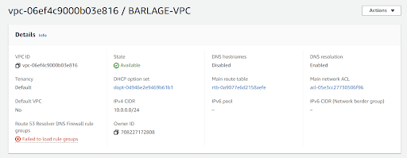
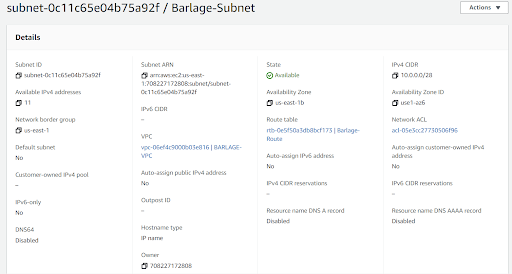
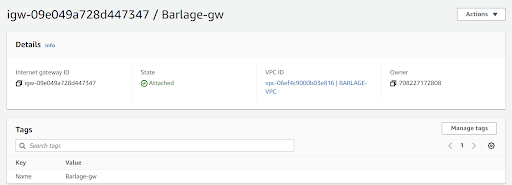
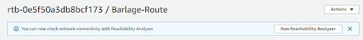
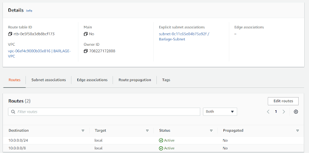
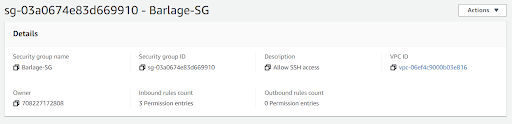
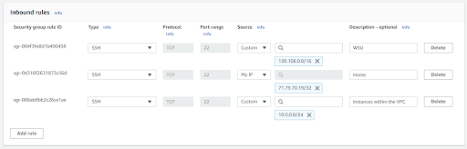
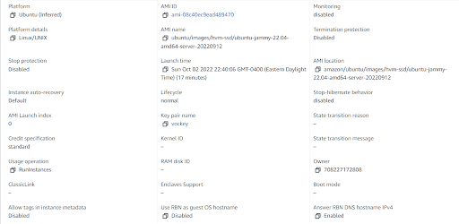
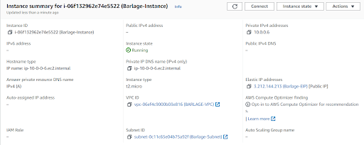
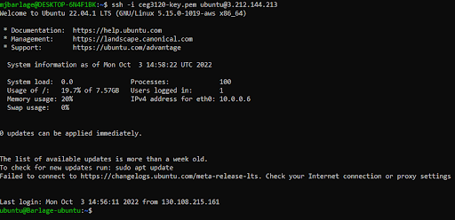

## Morgan Barlage

**Part 1**
1. Create a VPC 

2. Create a subnet  

3. Create an internet gateway  

4. Create a route table  

5. Create a security group  

**Part 2**
1. I selected ubuntu, the default username is ubuntu.. The instance type I selected was t2.micro
2. Inside of network settings, under VPC, I selected BARLAGE-VPC in the drop down menu
3. I decided to disable the auto-assign for the public IPv4 because I prefer to manually assign it to my instance
4. In configure storage, I selected 8 GiB and a gp2 root volume 
5. This was at the top of the launch instance page for me, I just typed Barlage-Instance under “Name”
6. Inside of Network settings, under Firewall (security groups), I selected “select existing security group” and selected Barlage-sg in the drop down menu
7. On the EC2 Dashboard, under Network and Security, I went to Elastic IPs and hit “allocate Elastic IP Address” and kept the default settings except for the name tag which i added as “Barlage-EIP”
8. Screenshot of instance details  

9. I typed the command “hostname Barlage-ubuntu” to change the hostname from the default “10-0-0-6”
10. Screenshot of ssh connection:  

