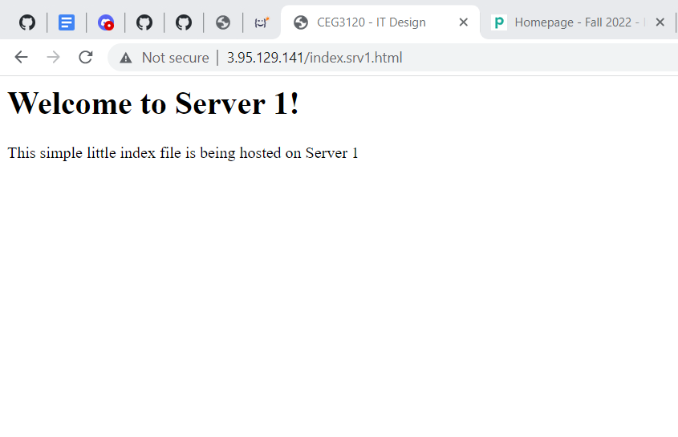
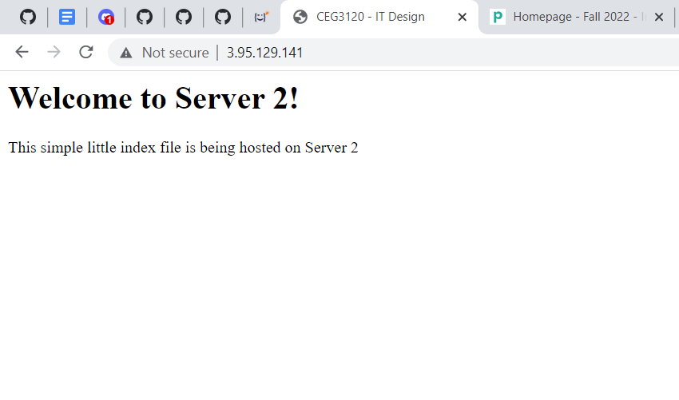

1. Config files
- Proxy config file: <br />

- Server 1 config file: <br />

- Server 2 config file: <br />
 <br />

2. Instances within the same VPC can connect via private IP addresses. Once I created my config files, I was able to ssh using only "ssh Host". I had trouble trying to use the generic ssh command such as ssh -i key ubuntu@private_ip. The only way that would work for me was using the config files. 

3. **_HAProxy configuration & documentation requirements_**
   - How to set up a HAProxy load balancer
     - What file(s) where modified & their location
     ```
     On the proxy instance, /etc/haproxy/haproxy.cfg was modified. I did copy the file to /etc/haproxy/haproxy.cfg.orig 
     in case I messed it up really bad. 
     ```
     - What configuration(s) were set (if any)
     ```
     I added these lines of code after the "default" block.
     
     frontend haproxy-main
         bind *:80
         option forwardfor
         default_backend apache_webservers

     backend apache_webservers
         balance roundrobin
         server webserver-1      10.0.1.11:80 check
         server webserver-2      10.0.1.12:80 check
     ```
     - How to restart the service after a configuration change
     ```
     $ sudo systemctl restart haproxy
     ```
     - Resources used (websites)
     ```
     https://linuxhostsupport.com/blog/how-to-install-and-configure-haproxy-on-ubuntu-20-04/
     ```
4. **_Webserver 1 & 2 configuration & documentation requirements_**
   - How set up a webserver
     - What file(s) were modified & their location
     ```
     On each server, the /etc/hosts and /var/www/html/index.html files were modified. 
     ```
     - What configuration(s) were set (if any)
     ```
     For /etc/hosts this was added:
     3.95.129.141 proxy
     ```
     - Where site content files were located (and why)
     ```
     The site content is located in /var/www/html/index.html. This is the default location.
     ```
     - How to restart the service after a configuration change
     ```
     $ sudo systemctl restart apache2.service
     ```
     - Resources used (websites)
     ```
     https://linuxhint.com/how-to-install-and-configure-haproxy-load-balancer-in-linux/
     ```
5.  <br />

   
  
6. (Optional) - link to your proxy so I can click it.
```
http://3.95.129.141/
```
